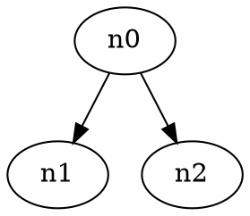

# Search Trees

## Two models of search trees
1. All objects are stored in leave nodes
   * A binary tree
   * Each interior node has a left and a right subtree
   * A tree of height $h$ contains at most $2^h$ objects
2. Object can be stored in branch nodes (when comparing equal)
   * Each node is really a ternary node (less than, equal, larger than)
   * An interior node may not have left or right subtree
   * A tree of height $h$ contains at most $2^{h+1}-1$ objects

## Tree node rotations
Move subtrees of an **interior** node $n$ (originally at height $h$).
<!--

-->

* Left rotation
  * Right child is an **internal** node
  * increase the height of the left subtree
  * node $n_2$ goes to height $h$, node $n$ goes to height $h+1$
  
<!--
  ```graphviz
  digraph {
    n0 -> n1
    n0 -> n2
    n2 -> n3
    n2 -> n4
  }

  ```

  ```graphviz
  digraph {
    n2 -> n0
    n0 -> n1
    n0 -> n3
    n2 -> n3 [style=invis]
    n2 -> n4
  }

  ```
-->

* Right rotation
  The exact inverse operation of left rotation
  * Left child is an **internal** node
  * increase the height of the right subtree

## Segment tree
* Use case
  * Answer **dynamic** range queries
    * e.g. range minimum query (RMQ): given a range (array indices), return the index of the smallest element
  * **static** range queries can be solved by DP
* Data structure
  * Array-based binary tree `st`, starting at index 1 (skipping index 0)
  * The value `st[p]` is the RMQ value of the segment associated with index `p`
  * The root of segment tree represents segment `[0, n-1]`
  * For each segment `[L, R]` stored in index `p` where `L != R`, the segment will be split into `[L, (L+R)/2]` and `[(L+R)/2+1, R]`


## Binary indexed (Fenwick) tree
* Use case
  * To implement **dynamic** cumulative frequency tables

## Interval tree
* Use case
  * To store a set of intervals. Given a query key, returns all the intervals that contain this query value
  * Can be used to solve the range sum query (RSQ) problem